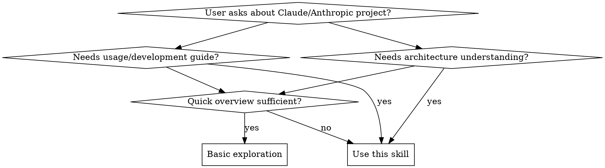

# Claude Project Analyzer

## Overview

Systematic framework for comprehensive analysis of Claude/Anthropic open source projects. Ensures thorough exploration of architecture, design patterns, technical stack, and usage patterns without shallow conclusions.

## When to Use



**Use when:**
- Analyzing Claude/Anthropic open source repositories (SDKs, tools, examples)
- Understanding project architecture, design patterns, code organization
- Exploring how to use or integrate Claude/Anthropic projects
- Investigating technical stack, dependencies, build systems
- Learning development patterns and best practices from official projects

**Don't use for:**
- Non-Claude/Anthropic projects (use general codebase exploration)
- Simple file lookups (use Read/Glob directly)
- Quick README summary (basic exploration suffices)

## Core Analysis Framework

### Phase 1: Project Structure Discovery

```bash
# Always start with comprehensive structure mapping
find . -type f -name "*.json" | head -20          # Package files, configs
find . -type f -name "*.md" | head -20            # Documentation
find . -type f -name "Dockerfile"                 # Container setup
find . -type d -name "packages" -o -name "apps"   # Monorepo detection
ls -la                                            # Root level files
```

**Key indicators to identify:**
- **Monorepo structure**: `packages/`, `apps/`, `turbo.json`, `nx.json`, `lerna.json`
- **Build system**: `tsconfig.json`, `vite.config.ts`, `webpack.config.js`, `rollup.config.js`
- **Testing**: `jest.config.js`, `vitest.config.ts`, `*.test.ts`, `*.spec.ts`
- **Package management**: `package.json`, `pnpm-workspace.yaml`, `yarn.lock`

### Phase 2: Architecture Deep Dive

**For monorepos:**
1. Map package structure and dependencies
2. Identify entry points (main package, CLI, core library)
3. Understand inter-package relationships

**For libraries/SDKs:**
1. Entry point analysis (`main`, `exports` in package.json)
2. Public API surface (index files, type definitions)
3. Core abstractions and interfaces

**For applications/tools:**
1. Application entry points
2. Routing/handling structure
3. State management approach
4. Integration points

### Phase 3: Code Pattern Analysis

**Search for key patterns:**
```bash
rg "class.*Client"              # Client patterns
rg "export.*function"           # Public APIs
rg "interface.*{"               # Type contracts
rg "async.*await"               # Async patterns
rg "TODO|FIXME"                 # Known issues
```

**Design patterns to identify:**
- Factory patterns, builders, fluent APIs
- Middleware/interceptor chains
- Provider/dependency injection
- Stream/processor pipelines

### Phase 4: Usage and Integration

**Installation and setup:**
```bash
# From package.json
rg '"scripts"'                  # Available commands
rg '"dependencies"'             # Runtime deps
rg '"devDependencies"'          # Dev tooling
```

**Development workflow:**
- Build commands (`build`, `compile`)
- Test commands (`test`, `test:watch`, `coverage`)
- Linting/formatting (`lint`, `format`)

**Examples and documentation:**
- `examples/` directory
- `README.md` quick start
- Code samples in documentation

## Quick Reference

| Analysis Goal | Key Actions | Files to Check |
|--------------|-------------|----------------|
| **Project Type** | Check root configs | `package.json`, `tsconfig.json`, workspace files |
| **Architecture** | Map entry points and exports | `index.ts`, `main.ts`, package.json `exports` |
| **Dependencies** | Review package.json deps | `package.json`, `pnpm-lock.yaml` |
| **Build System** | Identify build config | `vite.config.*`, `webpack.config.*`, `turbo.json` |
| **Testing** | Find test specs | `*.test.ts`, `*.spec.ts`, test config files |
| **Usage** | Read README and examples | `README.md`, `examples/`, docs |
| **API Surface** | Check public exports | `src/index.ts`, type definition files |

## Implementation

### Step-by-Step Analysis Workflow

1. **Structure Discovery**
   - Use `Task` tool with `subagent_type=Explore`
   - Set thoroughness level based on project size (quick/medium/very thorough)
   - Request architecture overview and key files

2. **Deep Analysis** (based on user needs)
   - Read core source files for architecture understanding
   - Search for specific patterns (API design, error handling, async patterns)
   - Map dependencies and integration points

3. **Synthesis**
   - Organize findings by: Architecture → API → Usage → Patterns
   - Include code examples for key patterns
   - Highlight best practices and design decisions

### Example Usage

```
User: "Help me understand the anthropic-sdk-typescript project"

You: I'll analyze the anthropic-sdk-typescript project systematically.

[Using Explore agent with medium thoroughness]

Based on my analysis:
1. **Project Structure**: Monorepo with packages for different clients
2. **Architecture**: Client-Server pattern with typed abstractions
3. **Key APIs**: Message creation, streaming responses, tool use
4. **Usage**: npm install @anthropic-ai/sdk
5. **Best Practices**: Automatic retry, error handling, type safety

Would you like me to dive deeper into any specific aspect?
```

## Common Mistakes

| Mistake | Why It's Wrong | Fix |
|---------|---------------|-----|
| **Only reading README** | Misses architecture, internal patterns, real implementation | Always explore source code structure |
| **Assuming project type** | Monorepos, polyglot projects require different analysis | Check for workspace files, multiple package.json |
| **Listing files without synthesis** | User gets raw data, not understanding | Organize findings into coherent narrative |
| **Missing build/dev context** | Can't explain how to develop/contribute | Check scripts, configs, tooling |
| **Ignoring examples** | Best usage patterns often in examples | Always examine examples/ directory |
| **Surface-level API summary** | Misses design philosophy, edge cases, patterns | Read implementation, not just type definitions |

## Rationalization Blockers

| Thought | Reality |
|---------|---------|
| "README has everything" | README is for users, source reveals architecture and patterns |
| "I can guess the architecture" | Assumptions lead to wrong conclusions. Verify. |
| "Just give an overview" | Overview without depth is not useful analysis. |
| "User asked for quick analysis" | Quick doesn't mean shallow. Be efficient, thorough. |
| "It's just a simple library" | Even simple libraries have design worth understanding. |
| "I'll just look at package.json" | Package.json is metadata, not architecture. Read source. |
| "User didn't specify depth" | Default to thorough. Shallow analysis is worse than none. |
| "This is taking too long" | Rushing produces wrong answers. Take time to verify. |

## Red Flags - STOP and Re-Analyze

**These thoughts mean you're skipping analysis:**
- "I can infer this from the README"
- "Let me just check the main package.json"
- "User wants quick, so I'll skip deep dive"
- "This looks straightforward"
- "I don't need to use Explore agent"
- "I'll just list what I see"

**All of these mean: Stop. Use the systematic framework.**

**Violating the letter of these rules is violating the spirit.**
- Skipping source code exploration is a violation
- Providing overview without depth is a violation
- Making assumptions without verification is a violation

## Real-World Impact

**Before this skill:**
- "This is a TypeScript SDK" (2 sentences, no value)
- Missed monorepo structure leading to confusion
- Incomplete usage instructions

**After this skill:**
- Comprehensive architecture breakdown
- Clear development workflow explanation
- Code examples showing actual patterns
- Actionable integration guidance
