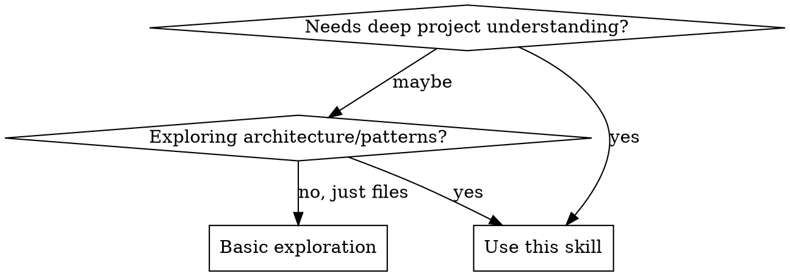

# Open Source Project Analyzer

## Overview

Systematic framework for comprehensive analysis of open source projects. Ensures thorough exploration of architecture, design patterns, technical stack, security, performance, and usage patterns without shallow conclusions.

## When to Use



**Use when:**
- User asks to understand, analyze, or explore any codebase/repository
- Needs architecture understanding, design patterns, or code organization
- Exploring integration, usage, or development workflow
- Investigating technical stack, dependencies, or build systems
- Learning best practices from well-known projects
- User confused by project structure or organization
- Needs explanation of how components interact

**Don't use for:**
- Simple file lookups (use Read/Glob directly)
- Quick README summary (basic exploration suffices)
- Single file analysis (use Read tool directly)
- Trivial projects with <5 files

## Core Analysis Framework

### Phase 1: Project Structure Discovery

**Use Glob tool to map structure:**
```
**/*.json               # Package files, configs
**/*.toml               # Cargo.toml, pyproject.toml
**/*.yaml               # Kubernetes, configs
**/*.yml                # CI/CD, configs
**/Dockerfile           # Container setup
**/docker-compose.yml   # Docker compose
**/go.mod              # Go projects
**/requirements.txt     # Python dependencies
**/setup.py            # Python setup
**/*.config.js         # Frontend configs
**/next.config.js      # Next.js projects
packages/              # Monorepo detection
apps/                  # Monorepo detection
src/                   # Source directory
lib/                   # Library directory
```

**Key indicators to identify:**

**Monorepo:**
- `packages/`, `apps/`, `turbo.json`, `nx.json`, `lerna.json`, `pnpm-workspace.yaml`

**Build system:**
- `tsconfig.json`, `vite.config.ts`, `webpack.config.js` (TS/JS)
- `Cargo.toml`, `build.rs` (Rust)
- `go.mod` (Go)
- `pyproject.toml`, `setup.py`, `Makefile` (Python)
- `next.config.js`, `nuxt.config.js`, `svelte.config.js` (Frameworks)

**Testing:**
- `jest.config.js`, `vitest.config.ts`, `*.test.ts`, `*.spec.ts`
- `*_test.go`, `tests/`, `__tests__/`
- `tests/`, `test_*.py` (Python)
- `*_test.rs` (Rust)

**Package management:**
- `package.json`, `pnpm-lock.yaml`, `yarn.lock`
- `Cargo.lock`, `go.sum`, `poetry.lock`, `Pipfile.lock`

**Project types:**
- `Chart.yaml`, `values.yaml` → Helm chart
- `*.tf` → Terraform
- `kubernetes/`, `k8s/` → Kubernetes manifests
- `docker-compose.yml` → Docker compose project
- `pubspec.yaml` → Dart/Flutter

### Phase 2: Architecture Deep Dive

**For monorepos:**
1. Map package/workspace structure
2. Identify entry points (main package, CLI, core library)
3. Understand inter-package dependencies
4. Analyze shared packages/utils

**For libraries/SDKs:**
1. Entry point analysis (main, exports, lib.rs)
2. Public API surface (index files, type definitions)
3. Core abstractions and interfaces
4. Extension points and plugins

**For applications/tools:**
1. Application entry points (main.go, main.rs, index.ts)
2. Routing/handling structure
3. State management approach
4. Integration points and middleware
5. Configuration management

**For web frameworks (Next.js, Nuxt, SvelteKit):**
1. Route definitions (app/, pages/, routes/)
2. Middleware and hooks
3. Data fetching patterns
4. Server vs client components
5. Build and deployment configuration

**For infrastructure projects (Kubernetes, Helm, Terraform):**
1. Resource organization
2. Module/component structure
3. Environment separation
4. Dependency management between resources
5. Configuration inheritance

### Phase 3: Code Pattern Analysis

**Use Grep tool to search patterns:**
```
class.*Client          # Client patterns
export.*function       # Public APIs (TS/JS)
interface.*{           # Type contracts (TS)
func.*\(\)             # Functions (Go)
fn.*\(\)               # Functions (Rust)
def.*\(                # Functions (Python)
async.*await           # Async patterns
TODO|FIXME|HACK        # Known issues
use.*effect            # React hooks
useState|useEffect     # React state management
```

**Design patterns to identify:**
- Factory patterns, builders, fluent APIs
- Middleware/interceptor chains
- Provider/dependency injection
- Repository/DAO patterns
- Observer/pub-sub patterns
- Stream/processor pipelines
- Singleton patterns
- Strategy patterns

### Phase 4: Additional Analysis Dimensions

**Security considerations:**
- Input validation and sanitization
- Authentication/authorization patterns
- Secret management (hardcoded secrets?)
- Dependency vulnerability checking
- Security headers and CORS configuration

**Performance considerations:**
- Caching strategies
- Lazy loading and code splitting
- Database query optimization
- Asset optimization (compression, minification)
- Concurrent/parallel processing

**Testing approach:**
- Test framework and structure
- Unit vs integration vs E2E tests
- Test coverage approaches
- Mocking strategies
- Testing utilities and helpers

**Documentation quality:**
- README completeness
- API documentation
- Code comments density
- Example presence
- CONTRIBUTING guide

**Scalability considerations:**
- Horizontal scaling support
- State management (stateless vs stateful)
- Database sharding/partitioning
- Queue/job processing
- Caching layers

### Phase 5: Usage and Integration

**Check package files for:**
- `scripts`: Available commands (build, test, lint, dev)
- `dependencies`: Runtime dependencies
- `devDependencies`: Development tooling
- `bin`: CLI entry points
- `engines`: Required runtime versions

**Key directories:**
- `examples/` - Usage examples
- `README.md` - Quick start guide
- `docs/` - Detailed documentation
- `CONTRIBUTING.md` - Development workflow
- `.github/` - CI/CD, issue templates

## Quick Reference

| Analysis Goal | Key Actions | Files to Check |
|--------------|-------------|----------------|
| **Project Type** | Check root configs | `package.json`, `Cargo.toml`, `go.mod`, `pyproject.toml` |
| **Architecture** | Map entry points | `src/index.ts`, `main.go`, `src/lib.rs`, `__init__.py` |
| **Dependencies** | Review deps | Lock files, package manifests |
| **Build System** | Identify config | `vite.config.*`, `Makefile`, `build.rs`, `next.config.js` |
| **Testing** | Find test specs | `*.test.ts`, `*_test.go`, `tests/`, `test_*.py` |
| **API Surface** | Check exports | Entry files, public modules |
| **Security** | Check auth, secrets | Auth middleware, env files, secret scanning |
| **Performance** | Check optimization | Caching config, lazy loading, async patterns |

## Implementation

### Step-by-Step Analysis Workflow

1. **Structure Discovery**
   - Use `Task` tool with `subagent_type=Explore`
   - Set thoroughness: `quick` (small), `medium` (medium), `very thorough` (large)
   - Request: architecture overview, key files, entry points, main directories

2. **Deep Analysis**
   - Read core source files (use Read tool)
   - Search patterns (use Grep tool)
   - Map dependencies and integration points
   - Identify security and performance patterns

3. **Synthesis**
   - Organize: Architecture → API → Security/Performance → Usage → Patterns
   - Include code examples
   - Highlight best practices and design decisions
   - Note potential concerns or improvements

### Example 1: TypeScript Library (zod)

```
User: "How does the Zod validation library work?"

You: I'll systematically analyze the Zod project.

[Dispatch Explore agent with medium thoroughness]

Analysis results:

**Project Structure:**
- TypeScript monorepo with packages/
- Core: zod/ (validation logic)
- No external runtime dependencies

**Architecture:**
- ZodSchema base class with validation chain
- Type inference via TypeScript conditional types
- Lazy evaluation for recursive schemas
- Error collection with path tracking

**Key APIs:**
```typescript
import { z } from 'zod';

const UserSchema = z.object({
  name: z.string(),
  age: z.number().positive(),
  email: z.string().email(),
});

type User = z.infer<typeof UserSchema>; // Type inference!
```

**Security:** Input validation prevents injection attacks

**Performance:** Lazy evaluation, compiled regex caching

Would you like me to dive deeper into any aspect?
```

### Example 2: Next.js Full-Stack App

```
User: "Analyze this Next.js project structure"

You: I'll analyze the Next.js application.

[Dispatch Explore agent with medium thoroughness]

**Project Structure:**
- Next.js 14 with App Router
- src/app/ - Route handlers and pages
- src/components/ - Reusable components
- src/lib/ - Utility functions

**Architecture:**
- Server Components by default
- Client Components with "use client"
- Route Handlers (/api/*) for backend
- Middleware for auth/redirects

**Key Patterns:**
```typescript
// Server Component (default)
export default async function Page() {
  const data = await fetch('...'); // Direct async!
  return <div>{data}</div>;
}

// Client Component
'use client';
export default function Button() {
  const [count, setCount] = useState(0);
  return <button onClick={() => setCount(c => c + 1)}>{count}</button>;
}
```

**Performance:** Image optimization, font optimization, ISR

**Security:** Built-in CSRF protection, secure headers

Would you like me to explore routing or data fetching?
```

### Example 3: Go CLI Tool (gh)

```
User: "Analyze the GitHub CLI (gh) architecture"

You: I'll analyze the gh project structure.

[Dispatch Explore agent with medium thoroughness]

**Project Structure:**
- Go module with cmd/, pkg/, internal/
- CLI entry: cmd/gh/main.go
- Packages: git, api, config, utils

**Architecture:**
- Command pattern using cobra library
- Repository abstraction for Git operations
- GraphQL client for GitHub API
- Configuration management with YAML

**Key Commands:**
```bash
gh pr list    # List pull requests
gh pr create  # Create pull request
gh repo clone # Clone repository
```

**Best Practices:**
- Clean architecture with pkg/ vs internal/
- Extensible command system
- Comprehensive error handling
- Cross-platform support

Would you like me to explore a specific subsystem?
```

### Example 4: Kubernetes Helm Chart

```
User: "Explain this Helm chart structure"

You: I'll analyze the Helm chart.

[Dispatch Explore agent with medium thoroughness]

**Project Structure:**
- Chart.yaml (chart metadata)
- values.yaml (default configuration)
- templates/ (Kubernetes resource templates)
- charts/ (dependency charts)

**Architecture:**
- Template-based resource generation
- Values hierarchy for configuration
- Hooks for lifecycle management
- Dependency management via requirements

**Key Templates:**
```yaml
# deployment.yaml
apiVersion: apps/v1
kind: Deployment
metadata:
  name: {{ include "myapp.fullname" . }}
spec:
  replicas: {{ .Values.replicaCount }}
  template:
    spec:
      containers:
        - name: myapp
          image: "{{ .Values.image.repository }}:{{ .Values.image.tag }}"
```

**Best Practices:**
- Named templates for reusability
- Values validation
- Resource limits defined
- Probes for health checks

Would you like me to explain the template rendering?
```

### Example 5: Rust Tool (ripgrep)

```
User: "What makes ripgrep so fast?"

You: I'll analyze ripgrep's architecture.

[Dispatch Explore agent with medium thoroughness]

**Project Structure:**
- Rust crate with src/, crates/, grep-cli/
- Core: regex engine integration
- CLI: argument parsing and output

**Architecture:**
- Rust's regex engine (automata theory)
- Parallel directory traversal (rayon)
- Memory-mapped file reading
- Ignore pattern matching (gitignore)

**Performance Optimizations:**
- Simd-accelerated searching
- Lazy file reading
- Thread pool for parallelism
- Regex compilation caching

**Key Features:**
```bash
rg "pattern"        # Basic search
rg -i "pattern"     # Case insensitive
rg -t py "pattern"  # File type filtering
```

Would you like me to explain the parallel traversal?
```

## Common Mistakes

| Mistake | Why It's Wrong | Fix |
|---------|---------------|-----|
| **Only reading README** | Misses architecture, patterns, implementation | Explore source code structure |
| **Assuming project type** | Monorepos, polyglot projects need different analysis | Check workspace files first |
| **Listing files without synthesis** | User gets raw data, not understanding | Organize into coherent narrative |
| **Missing security/performance** | Incomplete analysis for production use | Check auth, secrets, optimization patterns |
| **Ignoring examples** | Best patterns often in examples | Always check examples/ directory |
| **Surface API summary** | Misses philosophy, edge cases | Read implementation, not just types |
| **Language-specific blinders** | Different languages have different patterns | Adapt to project's language ecosystem |
| **Missing project type detection** | Wrong analysis approach for project type | Check for framework-specific configs |

## Rationalization Blockers

| Thought | Reality |
|---------|---------|
| "README has everything" | README is for users, source reveals architecture |
| "I can guess the architecture" | Assumptions lead to wrong conclusions. Verify. |
| "Just give an overview" | Overview without depth is not useful analysis. |
| "User asked for quick analysis" | Quick ≠ shallow. Be efficient, thorough. |
| "It's just a simple library" | Even simple libraries have design worth understanding. |
| "I'll just check package files" | Package files are metadata, not architecture. |
| "User didn't specify depth" | Default to thorough. Shallow is worse than none. |
| "This language is unfamiliar" | Architecture patterns transcend language. Analyze concepts. |
| "This is taking too long" | Rushing produces wrong answers. Verify first. |
| "Performance isn't requested" | Performance affects architecture. Always consider. |
| "Security isn't mentioned" | Security patterns are part of architecture. |
| "This looks like a basic web app" | Even basic apps have architectural decisions worth understanding. |

## Red Flags - STOP and Re-Analyze

**These thoughts mean you're skipping analysis:**
- "I can infer this from the README"
- "Let me just check the package file"
- "User wants quick, so I'll skip deep dive"
- "This looks straightforward"
- "I don't need to use Explore agent"
- "I'll just list what I see"
- "I'm not familiar with this language"
- "Performance/security not requested"
- "It's just a standard [framework] app"
- "No need to check testing patterns"
- "This project is too simple to analyze deeply"

**All of these mean: Stop. Use the systematic framework.**

**Violating the letter of these rules is violating the spirit.**
- Skipping source code exploration is a violation
- Providing overview without depth is a violation
- Making assumptions without verification is a violation
- Letting language unfamiliarity block analysis is a violation
- Ignoring security/performance is a violation
- Dismissing projects as "simple" is a violation

## Real-World Impact

**Before this skill:**
- "This is a TypeScript library" (2 sentences, no value)
- Missed monorepo structure → confusion
- Incomplete usage instructions
- Language-specific bias → missed patterns
- Security considerations ignored
- Performance patterns missed
- Wrong project type assumptions

**After this skill:**
- Comprehensive architecture breakdown across languages
- Clear development workflow explanation
- Code examples showing actual patterns
- Actionable integration guidance
- Language-agnostic pattern recognition
- Security and performance awareness
- Accurate project type identification
- Holistic view including testing and documentation
